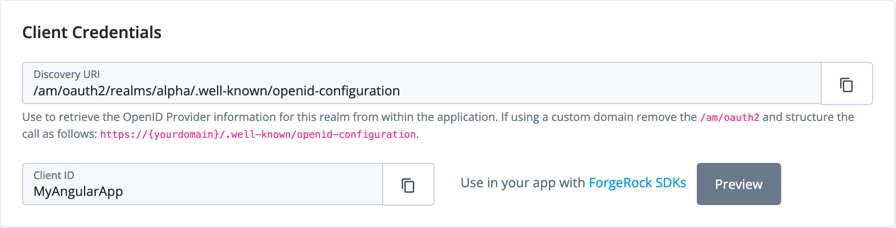

# ForgeRock Developer Experience Mockups

This project contains a set of HTML fragments representing the proposed changes in Spike SDKS-1199, which aims to research possible Developer Experience enhancements to the ForgeRock Identity Cloud admin UI, with regards to creating SDK applications.

## Using the fragments

Since the mockups for SDKS-1199 were generated rapidly using developer tools within a browser, they need to be pasted into a running session with ForgeRock Identity Cloud admin UI, on the relevant page.

To make it easier to find the right place to anchor the fragment, the root element of the fragment has been left as-is with regards to IDs, classes etc, and can be pasted in entirely once the relevant place on the page is found.

For example to paste in the client-credentials snippet, go to an existing OAuth2.0 application in the admin UI, and in developer tools find the element starting with ```<div class="card-body pb-0">``` and paste in the fragment entirely.

Each fragment has an associated screenshot with the same name, for example for client-credentials:

